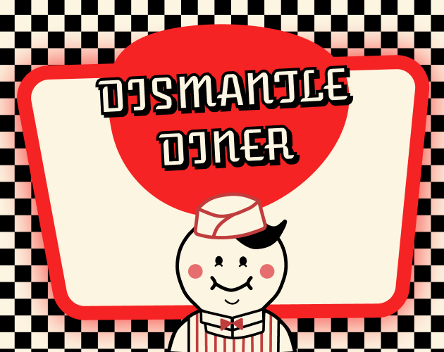

<!-- PROJECT LOGO -->
 

  

  <h3 align="center">Dismantle Diner</h3>

  

    Play as a chef that dismantles food to get to its basic ingredients.
     
    <a href="https://shockingshots.itch.io/dismantle-diner"><strong>Play the Game »</strong></a>
     
     
  

<!-- ABOUT THE PROJECT -->
## About The Project

  <!-- cover image -->
  

  Dismantle Diner is an un-merge game that was made in 48 hours for the 
  <a href="https://itch.io/jam/gmtk-2023">
    GTMK 2023 Game Jam
  </a>

### Built With

* [Unity](https://unity.com) (2021.3.6f1)
* [C#](https://docs.microsoft.com/en-us/dotnet/csharp)

 

<!-- CREDITS -->
## Credits

* beanc16 - [Twitter](https://twitter.com/shocking_shots) - [itch.io](https://shockingshots.itch.io) - [GitHub](https://github.com/beanc16)
  * Programmer

* Sara Bustamante - [Behance](https://www.behance.net/sarambustama)
  * UI/UX Design

Project Link: [https://github.com/beanc16/gmtk-2023](https://github.com/beanc16/gmtk-2023)

 

<!-- Play the Game -->
## [Play the Game](https://shockingshots.itch.io/dismantle-diner)
